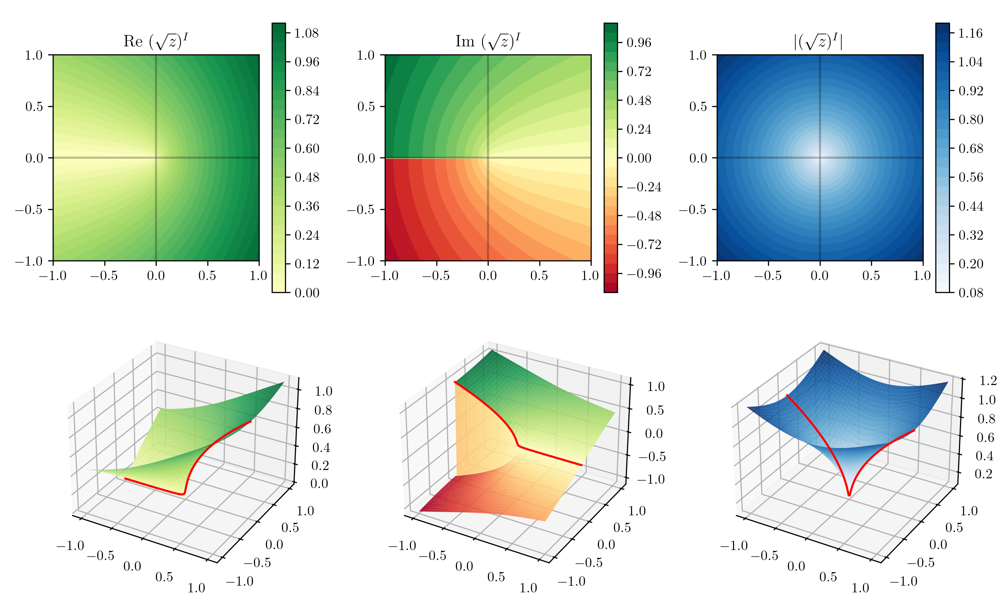
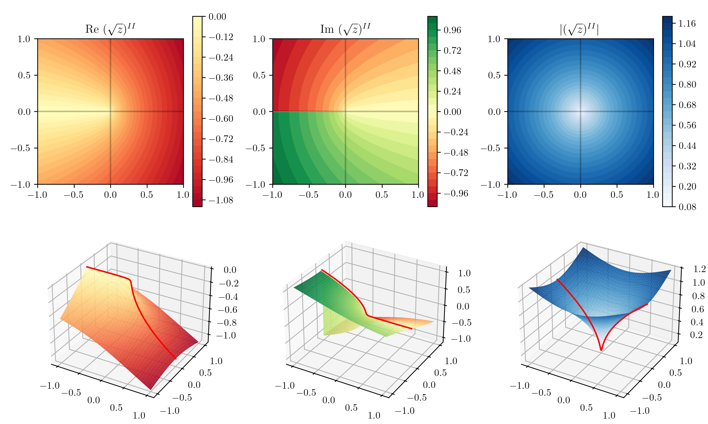
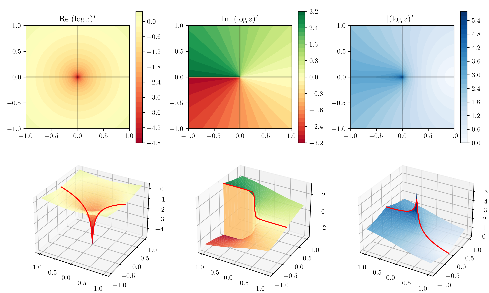
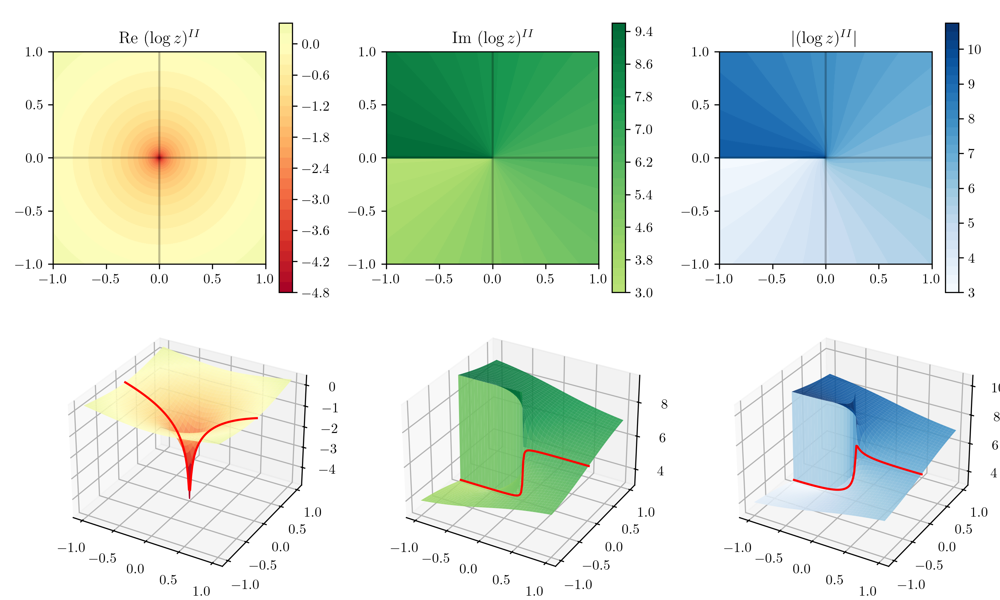

# Complex plotting

This is a mini project that allows one to plot complex functions. The syntax is

```python
import ComplexPlotting as CP

# Create meshgrids z_RE and z_IM, define a complex function.

CP.plot_complex(z_RE, z_IM, function(z_RE + 1j * z_IM))
```

## Examples

One of the most straightforward examples is the square root, which has a branch cut in a certain direction on the complex plane (depending on your convention).



The branch moves us to the second Riemann sheet, which is plotted below.



Another interesting function is the logarithm.



Unlike square root, logarithm has infinite amount of Riemann sheets, each obtained by adding/subtracting $2\pi i$ sequentially.

